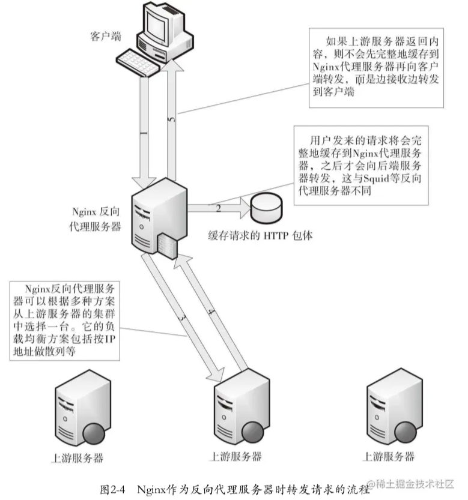

## 正向代理与反向代理

正向代理代理的是客户端，反向代理，代理的是服务器，对客户端透明。

反向代理（reverse proxy）方式是指用代理服务器来接受Internet上的连接请求，然后将请求转发给内部网络中的上游服务器，并将从上游服务器上得到的结果返回给Internet上请求连接的客户端，此时代理服务器对外表现一个web服务器。

Nginx的反向代理，当用户发送一个HTTP请求时，Nginx不会立刻转发到上游服务器，而是先把用户的请求（包括HTTP包体）完整地接收到Nginx所在的服务器的磁盘或内存中，然后再向上游服务器发起连接，把缓存的客户端请求转发到上游服务器。

> 优点：降低上游服务器的负载，尽量把压力放在Nginx服务器上
>
> 缺点：延长了一个请求的处理时间，并增加了用于缓存请求内容的内存和磁盘空间。



## location的匹配规则

location路由匹配格式：

```nginx
location [空格 | = | ~ | ~* | ^~ | @ ] /uri/ {
  ...
}
```

其实上面分为三部分:

1. 最前面的字符 (location modifier) 匹配规则
2. 后面 uri 的匹配规则 (location match)
3. 大括号内的路由转发

**下面依次介绍这三个部分**

### location modifier

---

支持以下修饰符：

```
[空格 | = | ~ | ~* | ^~ | @ ]
```

| 修饰符 | 解释                                                         |
| :----: | :----------------------------------------------------------- |
|  空格  | 如果直接是一个空格，那就是不写 location modifier ，Nginx 仍然能去匹配 pattern 。这种情况下，匹配那些以指定的 patern 开头的 URI，注意这里的 URI 只能是普通字符串，不能使用正则表达式。 |
|   =    | 表示精确匹配，如果找到，立即停止搜索并立即处理此请求。       |
|   ~    | 表示执行一个正则匹配，区分大小写匹配                         |
|   ~*   | 表示执行一个正则匹配，不区分大小写匹配， 注意，如果是运行 Nginx server 的系统本身对大小写不敏感，比如 Windows ，那么 ~* 和 ~ 这两个表现是一样的 |
|   ^~   | 即表示只匹配普通字符（跟空格类似，但是它优先级比空格高）。使用前缀匹配，^表示“非”，即不查询正则表达式。如果匹配成功，并且所匹配的字符串是最长的， 则不再匹配其他location。 |
|   @    | 用于定义一个 Location块，且该块不能被外部Client 所访问，只能被Nginx内部配置指令所访问，比如try_files 或 error_page |

Nginx官方的wiki翻译总结，按照*优先级*的步骤如下：

1. 优先查找精确匹配，精确匹配 (=) 的 location 如果匹配请求 URI 的话，此 location 被马上使用，匹配过程结束。
2. 接下来进行字符串匹配(空格 和 `^~`), 找到匹配最长的那个，如果发现匹配最长的那个是 `^~` 前缀, 那么也停止搜索并且马上使用，匹配过程结束。 否则继续往下走。
3. 如果字符串匹配没有，或者匹配的最长字符串不是 `^~` 前缀 (比如是空格匹配)，那么就继续搜索正则表达式匹配， 这时候就根据在配置文件定义的顺序，取最上面的配置(正则匹配跟匹配长度没关系，只跟位置有关系，只取顺序最上面的匹配)
4. 如果第三步找到了，那么就用第三步的匹配，否则就用第二步的匹配 (字符匹配最长的空格匹配)

这边注意几个细节:

1. 常规字符串匹配类型。是按前缀匹配(从根开始)。 而正则匹配是包含匹配，只要包含就可以匹配
2. ~ 和 ~* 的优先级一样，取决于在配置文件中的位置，最上面的为主，跟匹配的字符串长度没关系，所以在写的时候，应该越精准的要放在越前面才对
3. 空格匹配和 ^~ 都是字符串匹配，所以如果两个后面的匹配字符串一样，是会报错的，因为 nginx 会认为两者的匹配规则一致，所以会有冲突
4. ^~, =, ~, ~* 这些修饰符和后面的 URI 字符串中间可以不使用空格隔开(大部分都是用空格隔开)。但是 @ 修饰符必须和 URI 字符串直接连接。

##### 举个栗子

```nginx
location / {
  return 200 '404';
}

location ~ /hello {
  return 200 '1';
}

location ^~ /hello {
  return 200 '2';
}

location = /hello {
  return 200 '3';
}

location ~* /hello {
  return 200 '4';
}
测试结果为：
[root@VM_156_200_centos ~]# curl 127.0.0.1/hello  #精确匹配，直接结束
3
[root@VM_156_200_centos ~]# curl 127.0.0.1/hello11 #字符串匹配，并且最大长度的匹配是 ~^,直接结束
2
[root@VM_156_200_centos ~]# curl 127.0.0.1/hello/22 #字符串匹配，并且最大长度的匹配是 ~^,直接结束
2
[root@VM_156_200_centos ~]# curl 127.0.0.1/11/hello/ #字符串不匹配(前缀匹配)，正则匹配有两个，取最上面的那个
1
[root@VM_156_200_centos ~]# curl 127.0.0.1/11/Hello/ #字符串不匹配(前缀匹配)，正则匹配有一个(大小写不敏感)，取最上面的那个
4
[root@VM_156_200_centos ~]# curl 127.0.0.1/11/Hell #都不匹配，有设置通用匹配，取通用匹配
404
```

##### 再举个栗子：

```nginx
location /images/test.png {
  return 200  '1';     
}        

location ^~ /images/ { 
  return 200  '2';      
}    

location ~ /images/ {        
  return 200  '3';   
} 

location ~ /images/test.png {        
  return 200  '4';   
}
测试结果为：
[root@VM_156_200_centos ~]#  curl http://127.0.0.1/images/test.png 
3   // 这里是因为2的前序匹配不如4的正则匹配，则取正则匹配3或4，又3在4上面，正则匹配按位置说话
[root@VM_156_200_centos ~]#  curl http://127.0.0.1/images/1 
2  //此时前序匹配与正则匹配都只能匹配`/images`这个长度，则取前序匹配
```

##### 普通字符串的匹配冲突：

```nginx
location /images/test.png {
     return 200  '1';     
 }        

 location ^~ /images/test.png { 
      return 200  '2';      
 } 
此时reload会报错：
root@VM_156_200_centos sbin]# ./nginx -s reload
nginx: [emerg] duplicate location "/images/test.png" in /usr/local/nginx/conf/nginx.conf:20
```

> 注意：`~` 并不比` ~*` 优先级高，同时匹配，则仅取决于先后顺序

##### @前缀的命名匹配：

这个主要是内部定义一个 **location** 块，举个例子，因为 **location** 只验证 **uri**，参数是没有验证的，如果我们要验证参数，并且要根据不同的参数来进行不同的操作的话，就可以用这个内部定义块，举个例子:

```nginx
  location / {
    error_page 418 = @queryone;
    error_page 419 = @querytwo;
    error_page 420 = @querythree;

    if ( $args ~ "service=one" ) { return 418; }
    if ( $args ~ "service=two" ) { return 419; }
    if ( $args ~ "service=three" ) { return 420; }

    # do the remaining stuff
    # ex: try_files $uri =404;

  }

  location @queryone {
    return 200 'do stuff for one';
  }

  location @querytwo {
    return 200 'do stuff for two';
  }

  location @querythree {
    return 200 'do stuff for three';
  }
```

测试结果如下：

```nginx
[root@VM_156_200_centos ~]#  curl http://127.0.0.1/?service=one
do stuff for one

[root@VM_156_200_centos ~]#  curl http://127.0.0.1/?service=two
do stuff for two

[root@VM_156_200_centos ~]#  curl http://127.0.0.1/?service=three
do stuff for three
```

### Location Match[uri部分]

---

这部分主要是基于 PCRE正则表达式语法进行path的定义，也可基于内置变量与**lua**语法进行高级的函数定制，下面举几个例子：

1. 判断是不是ip白名单

```nginx
#定义初始值
set $my_ip 0;

#判断是否为指定的白名单
if ( $http_x_forwarded_for ~* "10.0.0.1|172.16.0.1" ){
    set $my_ip 1;
}

#不是白名单的IP进行重定向跳转
if ( $my_ip = 0 ){
    rewrite ^/$ /40x.html;
}
```

2. 如果页面有多语言，但是这个多语言所在的文件找不到，那么就将多语言路径去掉，重新跳转

```nginx
location / {
    if (!-e $request_filename) {
        rewrite ^/([A-Za-z0-9_-]+)/(.*) /$2 permanent;
    }
}
比如你请求是这样子的 https://foo.com/zh-cn/a.html 这时候服务端找不到这个文件，那么就会重定向到 https://foo.com/a.html。 这个很适合那种有多语言静态页面的站点
```

3. 如果是一些特殊的静态文件，那么额外配置

```nginx
location ~* \.(gif|jpg|jpeg|png|css|js|ico)$ {
    root /webroot/res/;
}
```

4. 禁止以/data开头的文件

```nginx
location ~ ^/data {
  deny all;
 }
```

5. 文件反盗链并设置过期时间

```nginx
 location ~* ^.+\.(jpg|jpeg|gif|png|swf|rar|zip|css|js)$ {
   valid_referers none blocked *.domain.com *.domain.net localhost 208.97.167.194;
    if ($invalid_referer) {
       rewrite ^/ http://error.domain.com/error.gif;
       return 412;
       break;
    }
    access_log  off;
    root /opt/lampp/htdocs/web;
    expires 3d;
    break;
 }
```

这里的 `return 412` 为自定义的 http 状态码，默认为`403`，方便找出正确的盗链的请求

- `rewrite ^/ http://error.domain.com/error.gif;`显示一张防盗链图片
- `access_log off;`不记录访问日志，减轻压力
- `expires 3d`所有文件3天的浏览器缓存

###### 最后附上可以用作判断的全局变量：

| 全局变量            | 内容                                                         |
| ------------------- | ------------------------------------------------------------ |
| $remote_addr        | 获取客户端ip                                                 |
| $binary_remote_addr | 客户端ip（二进制)                                            |
| $remote_port        | 客户端port，如：`50472`                                      |
| $remote_user        | 已经经过`Auth Basic Module`验证的用户名                      |
| $host               | 请求主机头字段，否则为服务器名称，如:`nothingtowork.fun`     |
| $request            | 用户请求信息，如：`GET ?a=1&b=2 HTTP/1.1`                    |
| $request_filename   | 当前请求的文件的路径名，由`root`或`alias`和`URI request`组合而成，如：`/2013/81.html` |
| $status             | 请求的响应状态码,如:`200`                                    |
| $body_bytes_sent    | 响应时送出的body字节数数量。即使连接中断，这个数据也是精确的,如：`40` |
| $content_length     | 等于请求行的`Content_Length`的值                             |
| $content_type       | 等于请求行的`Content_Type`的值                               |
| $http_referer       | 引用地址                                                     |
| $http_user_agent    | 客户端`agent`信息,如：`Mozilla/5.0 (Windows NT 5.1) AppleWebKit/537.36 (KHTML, like Gecko) Chrome/29.0.1547.76 Safari/537.36` |
| $args               | 与 `$query_string` 相同 等于当中URL的参数(GET)，如`a=1&b=2`  |
| $document_uri       | 与`$uri`相同, 这个变量指当前的请求URI，不包括任何参数(见$args) 如:`/2013/81.html` |
| $document_root      | 针对当前请求的根路径设置值                                   |
| $hostname           | 如：`centos53.localdomain`                                   |
| $http_cookie        | 客户端cookie信息                                             |
| $cookie_COOKIE      | `cookie COOKIE`变量的值                                      |
| $is_args            | 如果有`$args`参数，这个变量等于 `”?”`，否则等于`”"`          |
| $limit_rate         | 这个变量可以限制连接速率，0 表示不限速                       |
| $query_string       | 与$args相同,等于当中URL的参数(GET)，如`a=1&b=2`              |
| $request_body       | 记录POST过来的数据信息                                       |
| $request_body_file  | 客户端请求主体信息的临时文件名                               |
| $request_method     | 客户端请求的动作，通常为GET或POST,如：GET                    |
| $request_uri        | 包含请求参数的原始URI，不包含主机名，如：`/2013/81.html?a=1&b=2` |
| $scheme             | HTTP方法（如http，https）,如：http                           |
| $uri                | 这个变量指当前的请求URI，不包括任何参数(见$args) 如:`/2013/81.html` |
| $request_completion | 如果请求结束，设置为OK. 当请求未结束或如果该请求不是请求链串的最后一个时，为空(Empty)，如：OK |
| $server_protocol    | 请求使用的协议，通常是`HTTP/1.0`或`HTTP/1.1`，如：`HTTP/1.1` |
| $server_addr        | 服务器IP地址，在完成一次系统调用后可以确定这个值             |
| $server_name        | 服务器名称，如：`nothingtowork.fun`                          |
| $server_port        | 请求到达服务器的端口号,如：`80`                              |

### 路由转发

---

**location** 方法体内其实就是路由转发路由转发也是比较核心的部分，允许嵌套，

1. #### 返回状态码和值

   这个也是最常见的，就是返回 http 的状态码

   ```nginx
   location ~ /A.html {
     return 301 https://$server_name/B.html;
   }
   ```

2. #### 反向代理

   主要通过 proxy_pass 来实现，可以转发到内部服务，也可以转发到外部服务，同时要转发真实 ip

   ```nginx
   location / {
     proxy_set_header  X-Real-IP       $remote_addr;
     proxy_set_header  X-Forwarded-For $proxy_add_x_forwarded_for;
     proxy_pass https://foo.com;
   }
   ```

   ##### 负载均衡的基本配置：

   > 2.1 **upstream**

   语法：upstream name{......};

   配置块：http

   upstream块定义了一个上游服务器的集群，便于反向代理中的proxy_pass使用。

   ```nginx
   upstream backend {
   	server backend1.example.com;
   	server backend2.example.com;
   	server backend3.example.com;
   }
   server {
   	location / {
   		proxy_pass http://backend;
   	}
   }
   ```

   > 2.2 **server**

   语法：server name[parameters];

   配置块：upstream

   server指定一台上游服务器的名字，该名字可以是域名、ip地址端口、UNIX句柄等，后面可跟参数：

   `.weight=number`：设置向这台上游服务器转发的权重，默认是1。

   `.max_fails=number`：该选项与fail_timeout配合使用，指在fail_timeout时间段内，如果向当前的上游服务器转发失败次数超过number，则认为在当前的fail_timeout时间段内这台上游服务器不可用。max_fail默认为1，如果设置为0，表示不检查失败次数。

   `.fail_timeout=time`：fail_timeout表示该时间段内转发失败多少次后认为上游服务器暂时不可用，用于优化反向代理功能。它与向上游服务器建立连接的超时时间、读取上游服务器的响应超时时间等完全无关。默认为10s。

   `.down`：表示所有的上游服务器永久下线，只在使用ip_hash配置项时才有用。

   `.backup`：在使用ip_hash配置项时它是无效的。表示所在的上游服务器只是备份服务器，只有在所有的非备份上游服务器都失效后，才会向所在的上游服务器转发请求。

   ```nginx
   upstream backend {
       server backend1.example.com weight=5;
       server 127.0.0.1:8080 max_fails=3 fail_timeout=30s;
       server unix:/tmp/backend3;
   }
   ```

   > 2.3 **ip_hash**

   语法：ip_hash；

   配置块：upstream

   ip_hash是某个用户的请求始终落在固定的一台上游服务器上。它根据用户端的ip计算出一个key，将key按照upstream集群里的上游服务器数量进行取模，然后以取模后的结果把请求转发到相应的上游服务器中，这样确保了同一个客户端的请求只会转发到指定的上游服务器中。

   ip_hash与weight(权重)配置不可同时使用。如果upstream中一台服务器不能使用时，不能直接删除，而是使用down标识，来确保转发策略的一惯性。

   ```nginx
   upstream backend {
       ip_hash;
       server backend1.example.com;
       server backend2.example.com;
       server backend3.example.com down;
       server backend4.example.com;
   }
   ```

   ##### 反向代理的基本配置：

   > 2.1 **proxy_pass**

   语法：proxy_pass URL;

   配置块：location、if

   将当前请求反向代理到URL参数指定的服务器上，URL可以是主机名或IP地址+端口。

   ```nginx
   location / {
        proxy_pass http://localhost:8000/uri
   }
   ```

   默认情况下反向代理是不会转发请求中的Host头部的，如需转发需加上配置：`proxy_set_header Host $host;`

   > 2.2 **proxy_method**

   语法：proxy_method [GET/POST/DELETE/UPDATE/......];

   配置块：http、server、location

   表示转发时的协议方法名。

   ```nginx
   proxy_method POST;
   ```

   > 2.3 **proxy_hide_header**

   语法：proxy_hide_header the_header;

   配置块：http、server、location

   Nginx将上游服务器的响应转发给客户端，但默认不会转发：Date、Server、X-Pad和X-Accel-*。使用proxy_hide_header后可以任意地指定哪些HTTP头部字段不能被转发。

   > 2.4 **proxy_pass_header**

   语法：proxy_pass_header the_header

   配置块：http、server、location

   与proxy_hide_header功能相反，将原来禁止转发的header设置为允许转发。

   > 2.5 **proxy_pass_request_body**

   语法：proxy_pass_requst_body on|off;

   默认：proxy_pass_request_body on;

   配置块：http、server、location

   表示确定是否向上游服务器发送HTTP包体部分。

   > 2.6 **proxy_pass_request_headers**

   语法：proxy_pass_request_headers on|off;

   默认：proxy_pass_request_headers on;

   配置块：http、server、location

   作用为确定是否转发HTTP头部

   > 2.7 **proxy_redirect**

   语法：proxy_redirect[default|off|redirect replacement];

   默认：proxy_redirect default;

   配置块：http、server、location

   当上游服务器返回的响应是重定向或刷新（如301或302）请求时，proxy_redirect可以重设http头部的location或refresh字段。

   ```nginx
   proxy_redirect http://localhost:8000/two/  http://frontendone;
   ```

   上述代码如果上游服务器返回302,location字段的URL是**http://localhost:8000/two/some/uri/** 转发给客户端的location就是：http://frontendone/some/uri/

   > 2.8 **proxy_next_upstream**

   语法：proxy_next_upstream[error|timeout|invalid_header|http_500|http_502|http_503|http_504|http_404|off];

   默认：proxy_next_upstream error timeout;

   配置块：http、server、location

   表示当向一台上游服务器转发请求出现错误时，继续换一台上游服务器处理这个请求。

   proxy_next_upstream参数则说明在哪些情况下会继续选择下一台上游服务器转发请求：

   `.error`：当向上游服务器发起连接、发送请求、读取响应时出错。

   `.timeout`：发送请求或读取响应时发生超时。

   `.invalid_header`：上游服务器发送的响应是不合法的。

   `.http_500`：上游服务器返回的响应码是500。

   `.http_502`：上游服务器返回的响应码是502。

   `.http_503`：上游服务器返回的响应码是503。

   `.http_504`：上游服务器返回的响应码是504。

   `·http_404`：上游服务器返回的HTTP响应码是404。

   `.off`：关闭proxy_next_upstream功能-出错就选择另一台上游服务器再次转发。

3. #### Rewrite 命令

   rewrite 功能就是，使用 nginx 提供的全局变量或自己设置的变量，结合正则表达式和标志位实现 url 重写以及重定向。

   rewrite 只能放在`server{}`,`location{}`,`if{}`中，并且只能对域名后边的除去传递的参数外的字符串起作用

   ```nginx
   location ~ \.cgi$ {
     rewrite ^(.*)\.cgi$ $1.html last;
     return 301;
   }
   
   location ~ \.html$ {
     return 200 '1';
   }
   ```

   以上把将所有 `.cgi` 结尾的都重定向到 `.html` 结尾
